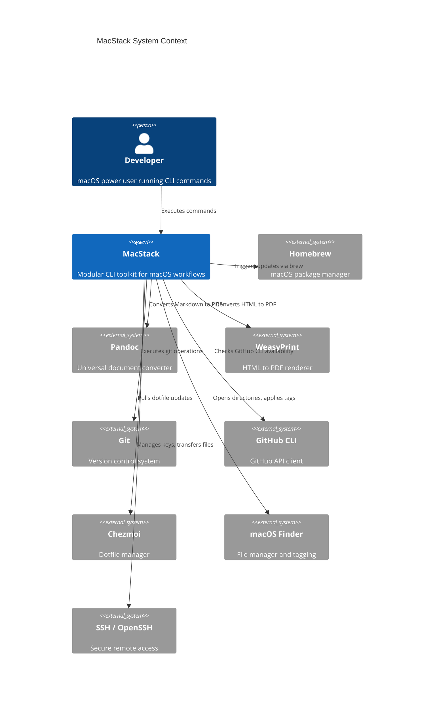

# 3. Context and Scope

## 3.1 Business Context

MacStack operates as a local CLI tool on a developer's macOS workstation. It has no network-facing APIs, no authentication, and no multi-user capabilities. All interactions are initiated by a human user via the terminal.

## 3.2 System Context

## 3.3 External Interfaces

| External System | Interface | Direction | Protocol | Required |
|----------------|-----------|-----------|----------|----------|
| Homebrew | CLI subprocess | Outbound | Process exec | No |
| Pandoc | CLI subprocess | Outbound | Process exec + stdin/stdout | No |
| WeasyPrint | CLI subprocess | Outbound | Process exec | No |
| Git | CLI subprocess | Outbound | Process exec | Yes |
| GitHub CLI (gh) | CLI subprocess | Outbound | Process exec | No |
| Chezmoi | CLI subprocess | Outbound | Process exec | No |
| macOS Finder | CLI subprocess (`open`, `tag`) | Outbound | Process exec | No |
| SSH / OpenSSH | CLI subprocess | Outbound | Process exec | No |
| ffmpeg | CLI subprocess | Outbound | Process exec | No |
| ImageMagick | CLI subprocess | Outbound | Process exec | No |
| Python 3 | CLI subprocess | Outbound | Process exec (http.server) | No |

## 3.4 Configuration Interface

MacStack reads configuration from the filesystem with the following precedence:

1. `$MACSTACK_CONFIG` environment variable (explicit override)
2. `$XDG_CONFIG_HOME/macstack/macstack.conf` (user config, default: `~/.config/macstack/macstack.conf`)
3. `<repo>/macstack.conf` (repository default)

Configuration is sourced as a Zsh script, making all variables immediately available to plugins.
