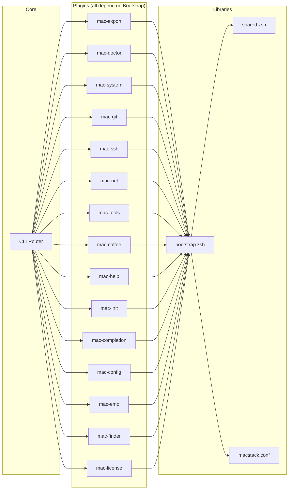

# 5. Building Block View

## 5.1 Level 1 — System Decomposition

```mermaid
graph TB
    subgraph MacStack
        Router["CLI Router<br>C# Native AOT Binary"]
        Bootstrap["Bootstrap Layer<br>bootstrap.zsh"]
        Shared["Shared Library<br>shared.zsh"]
        Config["Configuration<br>macstack.conf"]

        subgraph Plugins
            Export["mac-export"]
            Doctor["mac-doctor"]
            System["mac-system"]
            Git["mac-git"]
            SSH["mac-ssh"]
            Net["mac-net"]
            Tools["mac-tools"]
            Coffee["mac-coffee"]
            Help["mac-help"]
            Init["mac-init"]
            Completion["mac-completion"]
            ConfigPlugin["mac-config"]
            Emo["mac-emo"]
            Finder["mac-finder"]
            License["mac-license"]
        end
    end

    Router -->|discovers and executes| Plugins
    Bootstrap -->|sources| Shared
    Bootstrap -->|loads| Config
    Plugins -->|source| Bootstrap
```

## 5.2 Component Responsibilities

### 5.2.1 CLI Router (`src/mac/Program.cs`)

| Aspect | Detail |
|--------|--------|
| **Responsibility** | Parse command-line arguments, route to built-in commands or discover and execute plugins |
| **Built-in Commands** | `help`, `version`, `list` |
| **Plugin Discovery** | Searches `<MACROOT>/plugins/mac-<command>`, then `$PATH/mac-<command>` |
| **Technology** | C# / .NET 10 / Native AOT |
| **Exit Codes** | 0 (success), 1 (general error), 126 (not executable), 127 (not found) |

### 5.2.2 Bootstrap Layer (`lib/bootstrap.zsh`)

| Aspect | Detail |
|--------|--------|
| **Responsibility** | Validate `MACROOT`, source shared library, load configuration |
| **Contract** | Every plugin must source this file as its first action |
| **Failure Mode** | Exits with error if `MACROOT` is unset or shared library is missing |

### 5.2.3 Shared Library (`lib/shared.zsh`)

| Aspect | Detail |
|--------|--------|
| **Responsibility** | Provide common utilities to all plugins |
| **Capabilities** | Colored output, config loading, input validation, semantic filename generation, tool checks |
| **Key Functions** | `print_info`, `print_success`, `print_warn`, `print_error`, `require_value`, `macstack_load_config`, `generate_semantic_filename` |

### 5.2.4 Configuration (`macstack.conf`)

| Aspect | Detail |
|--------|--------|
| **Responsibility** | Define default values for export settings, integration toggles, and path references |
| **Format** | Zsh-sourceable key=value pairs |
| **Resolution** | `$MACSTACK_CONFIG` > `$XDG_CONFIG_HOME/macstack/macstack.conf` > repo default |

## 5.3 Plugin Overview

| Plugin | Domain | Subcommands | External Dependencies |
|--------|--------|-------------|----------------------|
| **mac-export** | Document Processing | `markdown`, `html` | Pandoc, WeasyPrint, `tag` |
| **mac-doctor** | Diagnostics | (default), `--audit` | None (checks for tools) |
| **mac-system** | System Management | `update`, `reboot`, `lock`, `clear-dns`, `clean` | Homebrew, Chezmoi, mas |
| **mac-git** | Git Shortcuts | `wip`, `wipp`, `undo-commit`, `reset-clean`, `size` | Git |
| **mac-ssh** | Networking | `pubkey`, `upload`, `df`, `sync-local`, `sync-remote`, `list` | SSH, rsync, scp |
| **mac-net** | Networking | `ip`, `local-ip`, `dns`, `routes`, `ports` | curl, networksetup |
| **mac-tools** | Utilities | `uuid`, `short-uuid`, `serve`, `trim`, `convert-webp`, `mkexec`, `retry`, `timestamp` | Python3, ffmpeg, ImageMagick |
| **mac-coffee** | Utilities | `on`, `off`, `status` | caffeinate |
| **mac-help** | Discovery | (routes to plugin --help) | None |
| **mac-init** | Setup | (default) | None |
| **mac-completion** | Development | `zsh` | None |
| **mac-config** | Diagnostics | `path`, `print`, `explain` | None |
| **mac-emo** | Utilities | Various emotions | pbcopy |
| **mac-finder** | macOS | (default) | Finder (`open`) |
| **mac-license** | Metadata | (default) | None |

## 5.4 Dependency Graph

