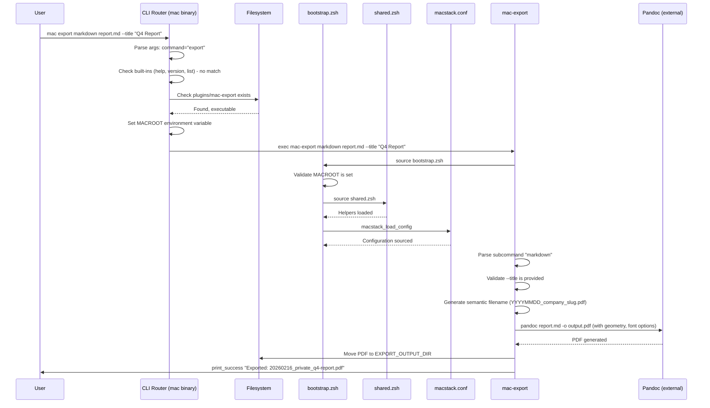
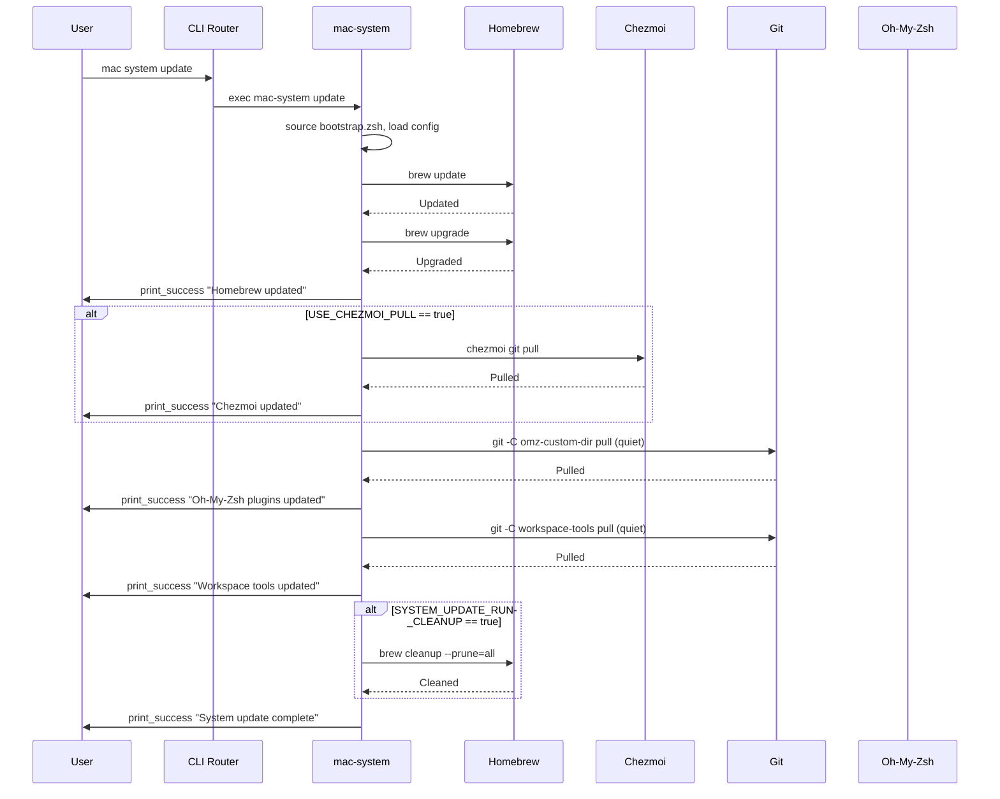
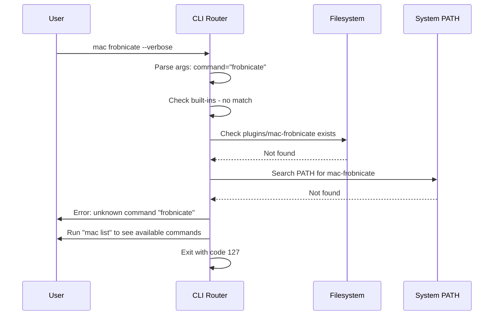
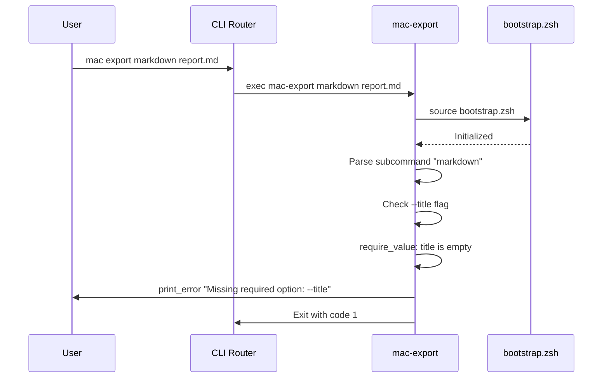

# 6. Runtime View

## 6.1 Scenario 1 — Command Startup and Plugin Execution

This scenario shows the full lifecycle of a user running `mac export markdown report.md --title "Q4 Report"`.

## 6.2 Scenario 2 — System Update Workflow

This scenario shows `mac system update`, which orchestrates multiple external tool updates.

## 6.3 Scenario 3 — Error Handling: Command Not Found

This scenario demonstrates the error path when a user invokes a non-existent command.

## 6.4 Scenario 4 — Plugin Validation Failure

This scenario shows error handling within a plugin when required arguments are missing.

