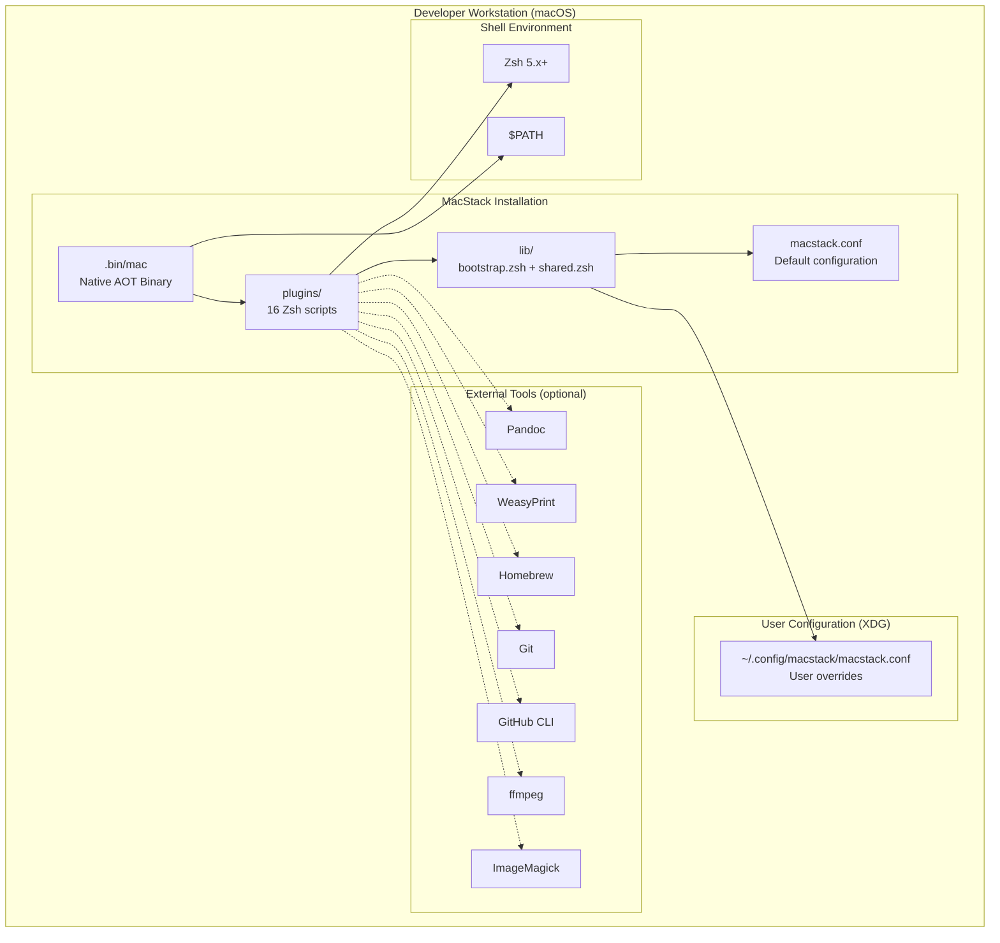
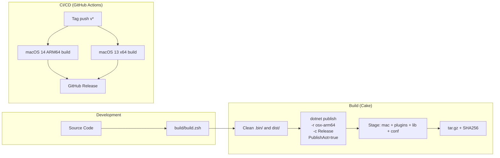

# 7. Deployment View

## 7.1 Deployment Model

MacStack is a local-only CLI tool. There are no servers, containers, or cloud infrastructure. The entire system runs on a single macOS workstation.

## 7.2 Deployment Diagram



## 7.3 Build and Release Pipeline



## 7.4 Installation Layout

After extraction from the distribution archive:

```
<install-root>/
  mac                    # Native AOT binary (add to $PATH)
  plugins/
    mac-export           # Document processing
    mac-doctor           # System diagnostics
    mac-system           # System management
    mac-git              # Git shortcuts
    mac-ssh              # SSH helpers
    mac-net              # Network utilities
    mac-tools            # General utilities
    mac-coffee           # Caffeinate toggle
    mac-help             # Help router
    mac-init             # Config initialization
    mac-completion       # Shell completions
    mac-config           # Config diagnostics
    mac-emo              # ASCII emotions
    mac-finder           # Finder integration
    mac-license          # License display
  lib/
    bootstrap.zsh        # Plugin bootstrap
    shared.zsh           # Shared utilities
  macstack.conf          # Default configuration
```

## 7.5 Runtime Requirements

| Requirement | Detail |
|-------------|--------|
| **OS** | macOS 12+ (Monterey or later) |
| **Architecture** | ARM64 (Apple Silicon) primary, x64 supported |
| **Shell** | Zsh 5.x+ (ships with macOS) |
| **.NET Runtime** | Not required (Native AOT) |
| **Disk Space** | ~10 MB (binary + plugins + libs) |
| **Permissions** | Standard user (no root required) |
