# 10. Quality Requirements

## 10.1 Quality Tree

```mermaid
graph TD
    Quality["Quality Goals"]
    Quality --> Performance["Performance"]
    Quality --> Usability["Usability"]
    Quality --> Maintainability["Maintainability"]
    Quality --> Reliability["Reliability"]
    Quality --> Portability["Portability"]

    Performance --> P1["Fast startup (sub-100ms)"]
    Performance --> P2["No background processes"]

    Usability --> U1["Discoverable commands"]
    Usability --> U2["Consistent help system"]
    Usability --> U3["Shell tab-completion"]

    Maintainability --> M1["Independent plugins"]
    Maintainability --> M2["Minimal shared code"]
    Maintainability --> M3["Convention over configuration"]

    Reliability --> R1["Fail-fast validation"]
    Reliability --> R2["Clear error messages"]
    Reliability --> R3["Deterministic behavior"]

    Portability --> Po1["No runtime dependencies"]
    Portability --> Po2["Single binary distribution"]
```

## 10.2 Quality Scenarios

| ID | Quality Attribute | Scenario | Expected Behavior |
|----|-------------------|----------|-------------------|
| QS-1 | Performance | User runs `mac version` | Response in under 50ms |
| QS-2 | Performance | User runs `mac export markdown` on a 10-page document | Completion within Pandoc's processing time plus <100ms overhead |
| QS-3 | Usability | User runs `mac` with no arguments | Displays help text with all available commands |
| QS-4 | Usability | User presses Tab after `mac ` | Shell shows all available commands with descriptions |
| QS-5 | Usability | User runs `mac frobnicate` (non-existent) | Clear error message suggesting `mac list` |
| QS-6 | Maintainability | Developer adds a new plugin | Only requires creating a single executable file with correct naming |
| QS-7 | Maintainability | Developer modifies a plugin | No recompilation of the core binary required |
| QS-8 | Reliability | User runs `mac export markdown` without `--title` | Immediate, specific error message before any file operations |
| QS-9 | Reliability | Required external tool is missing | Clear message naming the missing tool and how to install it |
| QS-10 | Portability | User installs MacStack on a new Mac | Extract archive, add to PATH, run `mac init` — no additional setup |

## 10.3 Testing Approach

**Assumption**: The project does not include an automated test suite. Testing is performed manually and via integration testing with `mac doctor`.

| Level | Approach |
|-------|----------|
| **Smoke Testing** | `mac doctor` validates the presence of required tools and configuration |
| **Integration Testing** | Manual execution of key workflows (export, system update) |
| **Build Verification** | CI/CD pipeline builds for both ARM64 and x64 targets |
| **Regression** | Manual verification before releases |
